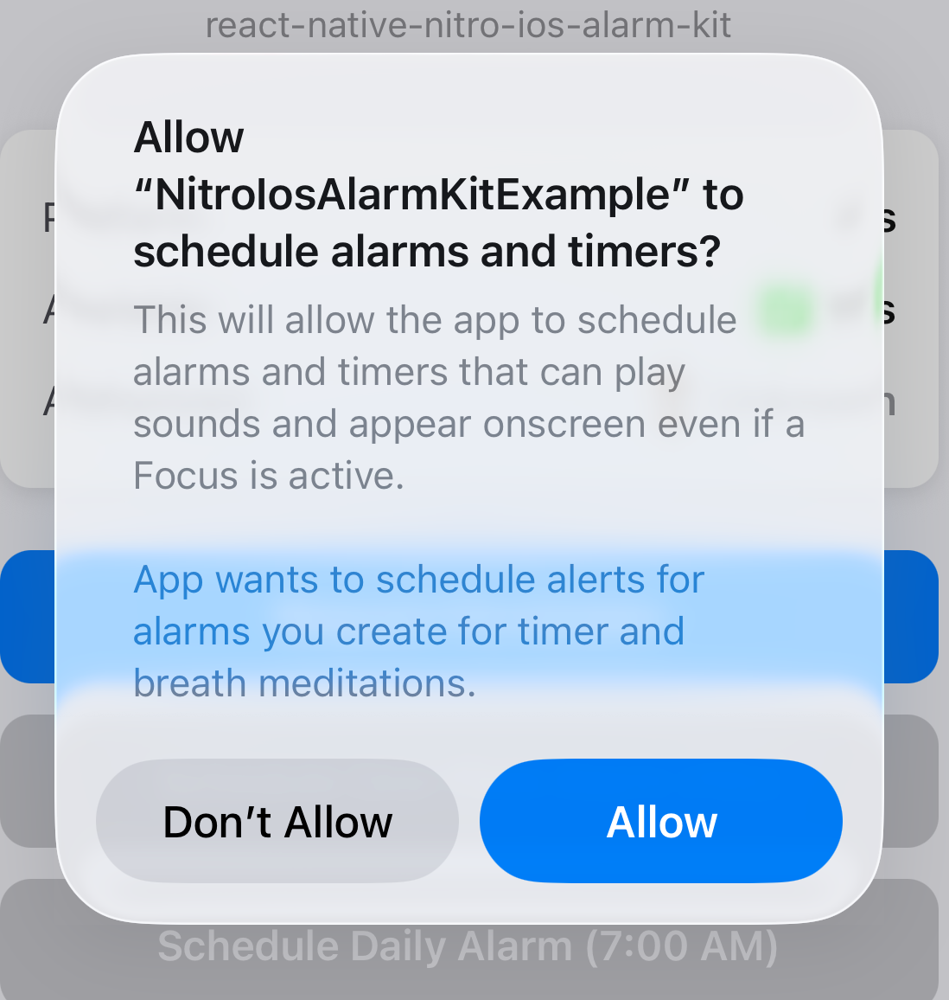

<a href="https://gauthamvijay.com">
  <picture>
    
  </picture>
</a>

# react-native-nitro-ios-alarm-kit

A **React Native Nitro Module** providing native iOS AlarmKit bindings for **scheduling system-level alarms** that work even when your app is closed.

- 🔵 **Apple AlarmKit API** (iOS 26+)
- ⏰ **Fixed, Repeating & Timer Alarms**
- 🎨 **Customizable Alarm UI**
- 🔊 **Custom Alarm Sounds**

---

> [!IMPORTANT]
>
> - Works in both Expo & Bare (Non Expo) React Native projects.
> - iOS 26+ only — Android returns no-op (false) for all methods.
> - **Requires physical device** — Simulator has limited support.
> - AlarmKit was introduced in iOS 26 (WWDC 2025).

---

## 📦 Installation

```bash
npm install react-native-nitro-ios-alarm-kit react-native-nitro-modules
```

Then run:

```bash
cd ios && pod install
```

---

## Demo

<table>
  <tr>
    <th align="center">🍏 iOS Demo</th>
    <th align="center">🔐 Permission Prompt</th>
  </tr>
  <tr>
    <td align="center">
      
    </td>
    <td align="center">
      
    </td>
  </tr>
</table>

---

## ⚙️ Configuration

### iOS

Add the AlarmKit usage description to your `Info.plist`:

```xml
<key>NSAlarmKitUsageDescription</key>
<string>Your app wants to schedule alerts for alarms you create.</string>
```

### Custom Sounds

To use custom alarm sounds:

1. Add your sound file (e.g., `magic.wav`) to your Xcode project's **main bundle**
2. Supported formats: `.wav`, `.aiff`, `.caf`
3. Pass the filename **without extension** to the `soundName` parameter

### Android

No configuration needed — all methods return `false` as AlarmKit is iOS-only.

---

## 🧠 Overview

| Feature             | Description                                                  |
| ------------------- | ------------------------------------------------------------ |
| **Fixed Alarms**    | Schedule one-time alarms at a specific timestamp             |
| **Relative Alarms** | Schedule repeating alarms (daily, weekly) at a specific time |
| **Timers**          | Schedule countdown timers that fire after a duration         |
| **Custom UI**       | Customize button text, colors, and SF Symbols icons          |
| **Custom Sounds**   | Use your own alarm sounds from the app bundle                |
| **Countdown**       | Configure pre-alert and post-alert (snooze) durations        |

---

## 💡 UI Tips for Dynamic Island

The Dynamic Island has very limited space. Follow these tips for best results:

| Tip | Why |
|-----|-----|
| **Keep titles under 15 characters** | Longer titles get truncated |
| **Use distinctive SF Symbol icons** | Only the icon shows in Dynamic Island, not button text |
| **Set short app display name** | Your `CFBundleDisplayName` shows in the alarm UI |

**Good icons for Dynamic Island:**
- Stop: `checkmark.circle.fill`, `stop.circle.fill`, `xmark.circle.fill`
- Snooze: `repeat.circle.fill`, `clock.arrow.circlepath`, `zzz`

---

## ⚙️ Usage

### Check Availability

```tsx
import { isAvailable } from 'react-native-nitro-ios-alarm-kit';

if (isAvailable()) {
  // AlarmKit is available (iOS 26+)
} else {
  // Fallback to local notifications or other alarm solution
}
```

### Request Permission

```tsx
import { requestAlarmPermission } from 'react-native-nitro-ios-alarm-kit';

const authorized = await requestAlarmPermission();

if (authorized) {
  // User granted alarm permission
} else {
  // Permission denied
}
```

### Schedule a Timer (Countdown)

```tsx
import { scheduleTimer } from 'react-native-nitro-ios-alarm-kit';

// Schedule a 5-minute timer
const success = await scheduleTimer(
  'Done! 🎉',           // title (keep SHORT!)
  {
    text: 'Stop',
    textColor: '#FFFFFF',
    icon: 'checkmark.circle.fill',  // Shows in Dynamic Island
  },
  '#FF6B6B',            // tintColor
  300,                  // 5 minutes in seconds
  {
    text: 'Snooze',
    textColor: '#FFFFFF',
    icon: 'repeat.circle.fill',
  },
  'magic'               // Custom sound: magic.wav (optional)
);
```

### Schedule a Fixed Alarm (One-Time)

```tsx
import { scheduleFixedAlarm } from 'react-native-nitro-ios-alarm-kit';

// Schedule alarm for 1 hour from now
const timestamp = Date.now() / 1000 + 3600;

const success = await scheduleFixedAlarm(
  'Wake Up!',           // title (keep SHORT!)
  {
    text: 'Stop',
    textColor: '#FFFFFF',
    icon: 'checkmark.circle.fill',
  },
  '#FF5733',            // tintColor
  {
    text: 'Snooze',
    textColor: '#FFFFFF',
    icon: 'repeat.circle.fill',
  },
  timestamp,            // Unix timestamp in seconds
  { postAlert: 540 },   // 9-min snooze (like iOS default)
  'alarm_sound'         // Custom sound (optional)
);
```

### Schedule a Relative Alarm (Repeating)

```tsx
import { scheduleRelativeAlarm } from 'react-native-nitro-ios-alarm-kit';

// Schedule alarm for 7:00 AM on weekdays
const success = await scheduleRelativeAlarm(
  'Wake Up!',           // title (keep SHORT!)
  {
    text: 'Stop',
    textColor: '#FFFFFF',
    icon: 'sun.max.fill',
  },
  '#FF9500',            // tintColor
  7,                    // hour (0-23)
  0,                    // minute (0-59)
  ['monday', 'tuesday', 'wednesday', 'thursday', 'friday'],
  {
    text: 'Snooze',
    textColor: '#FFFFFF',
    icon: 'moon.zzz.fill',
  },
  { postAlert: 540 },   // 9-min snooze
  'morning_alarm'       // Custom sound (optional)
);
```

### Full Example

```tsx
import { useState } from 'react';
import { View, Text, Pressable, StyleSheet, Alert } from 'react-native';
import {
  isAvailable,
  requestAlarmPermission,
  scheduleTimer,
  scheduleFixedAlarm,
  scheduleRelativeAlarm,
} from 'react-native-nitro-ios-alarm-kit';

export default function App() {
  const [authorized, setAuthorized] = useState<boolean | null>(null);

  const handleRequestPermission = async () => {
    if (!isAvailable()) {
      Alert.alert('Not Available', 'AlarmKit requires iOS 26+');
      return;
    }

    const result = await requestAlarmPermission();
    setAuthorized(result);
  };

  const handleScheduleTimer = async () => {
    if (!authorized) {
      Alert.alert('Permission Required', 'Please grant alarm permission first');
      return;
    }

    const success = await scheduleTimer(
      'Done! 🎉',
      { text: 'Stop', textColor: '#FFFFFF', icon: 'checkmark.circle.fill' },
      '#FF6B6B',
      10, // 10 seconds
      { text: 'Snooze', textColor: '#FFFFFF', icon: 'repeat.circle.fill' },
      'magic' // Optional: custom sound
    );

    if (success) {
      Alert.alert('Success', 'Timer set for 10 seconds');
    } else {
      Alert.alert('Error', 'Failed to schedule timer');
    }
  };

  const handleScheduleAlarm = async () => {
    if (!authorized) {
      Alert.alert('Permission Required', 'Please grant alarm permission first');
      return;
    }

    const timestamp = Date.now() / 1000 + 60; // 1 minute from now

    const success = await scheduleFixedAlarm(
      'Time Up!',
      { text: 'Done', textColor: '#FFFFFF', icon: 'checkmark.circle.fill' },
      '#007AFF',
      { text: 'Snooze', textColor: '#FFFFFF', icon: 'repeat.circle.fill' },
      timestamp,
      { postAlert: 300 } // 5-min snooze
    );

    if (success) {
      Alert.alert('Success', 'Alarm scheduled for 1 minute from now');
    }
  };

  const handleScheduleDaily = async () => {
    if (!authorized) {
      Alert.alert('Permission Required', 'Please grant alarm permission first');
      return;
    }

    const success = await scheduleRelativeAlarm(
      'Wake Up!',
      { text: 'Stop', textColor: '#FFFFFF', icon: 'sun.max.fill' },
      '#FF9500',
      7, 0, // 7:00 AM
      ['monday', 'tuesday', 'wednesday', 'thursday', 'friday'],
      { text: 'Snooze', textColor: '#FFFFFF', icon: 'moon.zzz.fill' },
      { postAlert: 540 } // 9-min snooze
    );

    if (success) {
      Alert.alert('Success', 'Daily alarm scheduled for 7:00 AM on weekdays');
    }
  };

  return (
    <View style={styles.container}>
      <Text style={styles.title}>iOS AlarmKit Demo</Text>

      <Text style={styles.status}>
        Available: {isAvailable() ? '✅ Yes' : '❌ No'}
      </Text>
      <Text style={styles.status}>
        Authorized:{' '}
        {authorized === null ? '⏳ Unknown' : authorized ? '✅ Yes' : '❌ No'}
      </Text>

      <Pressable style={styles.button} onPress={handleRequestPermission}>
        <Text style={styles.buttonText}>Request Permission</Text>
      </Pressable>

      <Pressable style={[styles.button, styles.timerButton]} onPress={handleScheduleTimer}>
        <Text style={styles.buttonText}>⏱️ Schedule Timer (10s)</Text>
      </Pressable>

      <Pressable style={styles.button} onPress={handleScheduleAlarm}>
        <Text style={styles.buttonText}>🔔 Schedule Alarm (1 min)</Text>
      </Pressable>

      <Pressable style={[styles.button, styles.dailyButton]} onPress={handleScheduleDaily}>
        <Text style={styles.buttonText}>☀️ Schedule Daily (7:00 AM)</Text>
      </Pressable>
    </View>
  );
}

const styles = StyleSheet.create({
  container: {
    flex: 1,
    padding: 20,
    backgroundColor: '#f4f6f8',
    alignItems: 'center',
    justifyContent: 'center',
    gap: 16,
  },
  title: {
    fontSize: 24,
    fontWeight: '700',
    marginBottom: 20,
  },
  status: {
    fontSize: 16,
    color: '#666',
  },
  button: {
    backgroundColor: '#007AFF',
    borderRadius: 12,
    paddingVertical: 14,
    paddingHorizontal: 24,
    width: '100%',
  },
  timerButton: {
    backgroundColor: '#FF6B6B',
  },
  dailyButton: {
    backgroundColor: '#FF9500',
  },
  buttonText: {
    color: '#FFFFFF',
    fontSize: 16,
    fontWeight: '600',
    textAlign: 'center',
  },
});
```

---

## 📖 API Reference

### `isAvailable(): boolean`

Returns `true` if AlarmKit is available (iOS 26+), `false` otherwise.

### `requestAlarmPermission(): Promise<boolean>`

Requests permission to schedule alarms. Returns `true` if authorized, `false` otherwise.

### `scheduleTimer(title, stopBtn, tintColor, durationSeconds, secondaryBtn?, soundName?): Promise<boolean>`

Schedules a countdown timer that fires after the specified duration.

| Parameter         | Type                      | Required | Description                                    |
| ----------------- | ------------------------- | -------- | ---------------------------------------------- |
| `title`           | `string`                  | ✅       | Timer title (keep under 15 chars)              |
| `stopBtn`         | `CustomizableAlarmButton` | ✅       | Primary stop button configuration              |
| `tintColor`       | `string`                  | ✅       | Hex color for timer UI (e.g., `#FF6B6B`)       |
| `durationSeconds` | `number`                  | ✅       | Timer duration in seconds                      |
| `secondaryBtn`    | `CustomizableAlarmButton` | ❌       | Optional secondary button                      |
| `soundName`       | `string`                  | ❌       | Sound file name without extension              |

### `scheduleFixedAlarm(title, stopBtn, tintColor, secondaryBtn?, timestamp?, countdown?, soundName?): Promise<boolean>`

Schedules a one-time alarm at a specific Unix timestamp.

| Parameter      | Type                      | Required | Description                              |
| -------------- | ------------------------- | -------- | ---------------------------------------- |
| `title`        | `string`                  | ✅       | Alarm title (keep under 15 chars)        |
| `stopBtn`      | `CustomizableAlarmButton` | ✅       | Primary stop button configuration        |
| `tintColor`    | `string`                  | ✅       | Hex color for alarm UI (e.g., `#FF5733`) |
| `secondaryBtn` | `CustomizableAlarmButton` | ❌       | Optional secondary button (e.g., Snooze) |
| `timestamp`    | `number`                  | ❌       | Unix timestamp in seconds                |
| `countdown`    | `AlarmCountdown`          | ❌       | Snooze duration configuration            |
| `soundName`    | `string`                  | ❌       | Sound file name without extension        |

### `scheduleRelativeAlarm(title, stopBtn, tintColor, hour, minute, repeats, secondaryBtn?, countdown?, soundName?): Promise<boolean>`

Schedules a repeating alarm at a specific time on given weekdays.

| Parameter      | Type                      | Required | Description                       |
| -------------- | ------------------------- | -------- | --------------------------------- |
| `title`        | `string`                  | ✅       | Alarm title (keep under 15 chars) |
| `stopBtn`      | `CustomizableAlarmButton` | ✅       | Primary stop button configuration |
| `tintColor`    | `string`                  | ✅       | Hex color for alarm UI            |
| `hour`         | `number`                  | ✅       | Hour (0-23)                       |
| `minute`       | `number`                  | ✅       | Minute (0-59)                     |
| `repeats`      | `AlarmWeekday[]`          | ✅       | Days to repeat                    |
| `secondaryBtn` | `CustomizableAlarmButton` | ❌       | Optional secondary button         |
| `countdown`    | `AlarmCountdown`          | ❌       | Snooze duration configuration     |
| `soundName`    | `string`                  | ❌       | Sound file name without extension |

---

## 🎨 Types

```typescript
interface CustomizableAlarmButton {
  text: string;       // Button label
  textColor: string;  // Hex color (e.g., '#FFFFFF')
  icon?: string;      // SF Symbol name (e.g., 'checkmark.circle.fill')
}

interface AlarmCountdown {
  preAlert?: number;  // Seconds before alarm (for countdown display)
  postAlert?: number; // Snooze duration in seconds
}

type AlarmWeekday =
  | 'monday'
  | 'tuesday'
  | 'wednesday'
  | 'thursday'
  | 'friday'
  | 'saturday'
  | 'sunday';
```

---

## 🧩 Platform Support

| Platform          | Status                              |
| ----------------- | ----------------------------------- |
| **iOS 26+**       | ✅ Fully Supported                  |
| **iOS < 26**      | ⚠️ Returns `false`                  |
| **iOS Simulator** | ⚠️ Limited (permissions only)       |
| **Android**       | ❌ No-op (returns `false`)          |

---

## 🤝 Contributing

Pull requests welcome!

- [Development Workflow](CONTRIBUTING.md#development-workflow)
- [Sending a PR](CONTRIBUTING.md#sending-a-pull-request)
- [Code of Conduct](CODE_OF_CONDUCT.md)

---

## 🪪 License

MIT © [**Gautham Vijayan**](https://gauthamvijay.com)

---

Made with ❤️ and [**Nitro Modules**](https://nitro.margelo.com)